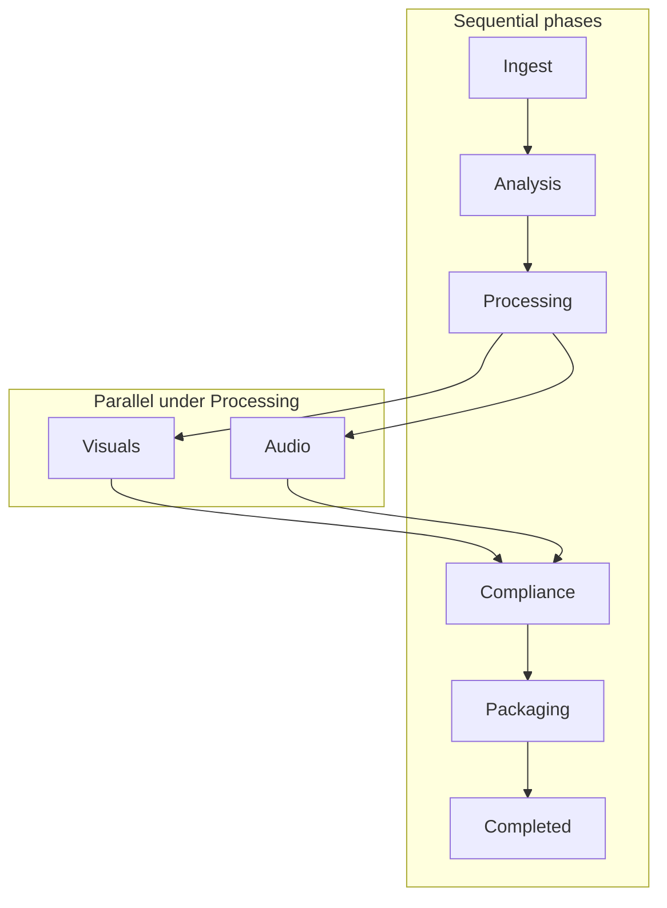

# Orchestrated Media Pipeline

A **video processing pipeline** (simplified Netflix-style workflow).

- **Orchestrator-led** — one workflow drives a source file through validation, analysis, parallel processing, compliance, and packaging.
- **Structured output** — produces a folder bundle suited to streaming-style demos.

**Pipeline phases:**

- **Ingest** — SHA-256 integrity check when a checksum is supplied, plus ffprobe-based format validation.
- **Analysis** — ffmpeg silencedetect, blackdetect, and scene detection feeding `scene_analysis.json`.
- **Visuals** — BPP-derived encoding profile, ffmpeg transcoding into nine renditions (three codecs × three resolutions), sprite map, and thumbnails.
- **Audio** — Python-backed faster-whisper transcription, deep-translator translation, and gTTS dubbing.
- **Compliance** — ffprobe-based safety flagging and ffmpeg logo overlay branding.
- **Packaging** — `manifest.json` plus HLS-style packaging: AES-128 segmented output under `output/<jobId>/drm/` (playlists listed in `drmAssets`).




## Architecture highlights

- **`PipelineStage<I, O>`** — shared generic contract for stage implementations that take typed input and return typed output, with failures surfaced as `PipelineException`.
- **`FfmpegRunner`** — centralizes safe ffmpeg/ffprobe execution and is supplied per stage via constructor injection.
- **`DefaultAnalysisService`** — runs the heavy ffmpeg filter passes once, bundles outputs into `RawAnalysisData`, and feeds parsers so intro/outro detection, credit rolling, and scene indexing do not repeat subprocess work.
- **Parallelism** — `Orchestrator` runs **Visuals** and **Audio** concurrently with `CompletableFuture` on a dedicated `ExecutorService`. Inside **Analysis**, `IntroOutroDetectorService` and `CreditRollerService` run in parallel; `SceneIndexerService` runs after both complete.
- **`ProgressReporter`** — implemented by **`ConsoleProgressReporter`** (CLI timestamps and durations) and **`NoOpProgressReporter`**.
- **`PipelineFactory`** — composition root that wires default implementations into `Orchestrator`.
- **Domain model** — Java `record` types with compact constructors for validation; `JobStatus` enum for lifecycle; `SceneSegment` carries scene intervals and a **string** category label.
- **Context objects** — `AnalysisContext`, `VisualsContext`, `AudioContext`, `ComplianceContext`, and `PackagingContext` pass only what each phase needs instead of one oversized context type.

## Prerequisites

- **Java 23**
- **Maven 3.8+**
- **ffmpeg** and **ffprobe** on `PATH` (Windows example):
  ```bash
  winget install ffmpeg
  ```
- **Python 3.9+** with:
  ```bash
  pip install faster-whisper
  pip install deep-translator
  pip install gTTS
  ```
- **Environment variables** — the Java code only reads **`PYTHON_BIN`** (optional path/name for the Python executable used to run `transcribe.py`, `translate.py`, and `dub.py`; if unset or blank, services default to **`python`**).

## Building

- Run Maven from the **`video-pipeline`** module.
- **`mvn package -DskipTests`** builds a **fat JAR** (runtime dependencies merged via **Maven Shade**).
- Output artifact: **`video-pipeline/target/video-pipeline-1.0-SNAPSHOT.jar`**

```bash
cd video-pipeline
mvn package -DskipTests
```

## Running

```bash
cd video-pipeline
java -jar target/video-pipeline-1.0-SNAPSHOT.jar <jobId> <sourceFile> [expectedChecksum]
```

Example:

```bash
java -jar target/video-pipeline-1.0-SNAPSHOT.jar movie_101 ../samples/input.mp4
```

- **Working directory** — run from `video-pipeline` (or adjust paths); outputs go under **`output/<jobId>/`** relative to the JVM’s current directory.
- **Manifest paths** — entries are written with forward slashes; resolve them relative to that working directory.
- **Visuals vs compliance** — **Visuals** writes the nine renditions under **`video/<codec>/`**. Compliance writes branded copies under **`compliance/video/<codec>/`** as **`*_branded.<ext>`** (same layout as `video/`, mirrored filenames with the `_branded` suffix). The originals under **`video/`** are left as transcoded (unbranded) sources.
- **Packaging** — **`manifest.json`** at the job root; **`drm/`** holds HLS AES-128 output (see tree). **`drmAssets`** in the manifest lists each **`playlist.m3u8`**. The **`transcodedVideos`** array in the manifest reflects **post-compliance** paths (the branded files under **`compliance/video/`**).

Expected layout:

```text
output/<jobId>/
  video/                         # nine renditions from Visuals (unbranded)
    h264/
      720p_h264.mp4
      1080p_h264.mp4
      4k_h264.mp4
    vp9/
      (3 × .webm)
    hevc/
      (3 × .mkv)
  compliance/video/              # branded copies from Compliance Phase
    h264/
      720p_h264_branded.mp4
      1080p_h264_branded.mp4
      4k_h264_branded.mp4
    vp9/
      (3 × *_branded.webm)
    hevc/
      (3 × *_branded.mkv)
  images/
    sprite_map.jpg
    thumbnails/
      thumb_0001.jpg
      …
  text/
    source_transcript.txt
    ro_translation.txt
  audio/
    ro_dub_synthetic.aac
  metadata/
    scene_analysis.json
  drm/                           # HLS-style output from Packaging (DrmWrapper)
    encryption.key               # shared AES-128 key (16 bytes)
    encryption.keyinfo           # key URL + local key path for ffmpeg
    h264/
      playlist.m3u8
      segment_000.ts
      segment_001.ts
      …                          # ~10 s segments, encrypted
    vp9/
      playlist.m3u8
      segment_*.ts
    hevc/
      playlist.m3u8
      segment_*.ts
  manifest.json                  
```

## Testing

- **Default (`mvn test`)** — fast run; skips slow **ffmpeg** transcoding, **compliance**, and **packaging** steps in `PipelineIntegrationTest` (unless opted in below).
- **Full visuals pipeline** — CPU- and time-intensive; enable with **`-Drun.visuals.test=true`**.
- **Audio tests** — need Python and the pip packages from Prerequisites; **`assumeTrue`** skips when tools or network are unavailable instead of failing the build.

```bash
cd video-pipeline
mvn test
```

```bash
cd video-pipeline
mvn test -Drun.visuals.test=true
```

## Design decisions

- **BPP / encoding profile** — bits-per-pixel from container metadata approximates visual complexity before nine transcodes, avoiding a full decode for per-frame entropy.
- **Shared analysis probes** — ffmpeg filters run once into **`RawAnalysisData`** so parsers share one subprocess snapshot.
- **Sequential vs parallel** — phases stay ordered where outputs are real prerequisites (ingest → analysis → processing → compliance → packaging); only **visuals** and **audio** overlap under **Processing**.
- **`FfmpegRunner` composition** — injected into services instead of a separate subprocess-stage hierarchy; timeouts and stream draining live in one place.
- **Focused context records** — each phase receives a small, purpose-built record, keeping dependencies explicit.
- **`ProgressReporter` + `NoOpProgressReporter`** — orchestrator always has a reporter; no-op for quiet tests (Null Object pattern).

## Package layout

- **Java sources** — under `video-pipeline/src/main/java/app/` (see tree).
- **Python helpers** — `video-pipeline/scripts/` (`transcribe.py`, `translate.py`, `dub.py`).

```text
video-pipeline/src/main/java/app/
  Main.java
  PipelineFactory.java
  common/
    FfmpegRunner.java
    PipelineException.java
    PipelineJson.java
    PipelineStage.java
    PipelineStageName.java
    TimestampUtils.java
  model/
    AnalysisContext.java
    AnalysisResult.java
    AudioContext.java
    AudioResult.java
    ComplianceContext.java
    ComplianceResult.java
    ContentFlag.java
    EncodingProfile.java
    FormatInfo.java
    IngestResult.java
    JobRequest.java
    JobStatus.java
    PackagingContext.java
    PackagingResult.java
    SceneSegment.java
    TranscodedVideo.java
    VisualsContext.java
    VisualsResult.java
  orchestrator/
    ConsoleProgressReporter.java
    NoOpProgressReporter.java
    Orchestrator.java
    PipelineJob.java
    ProgressReporter.java
    Transitions.java
  services/
    ingest/          (DefaultIngestService, FormatValidatorService, IntegrityCheckService, …)
    analysis/        (DefaultAnalysisService, IntroOutroDetectorService, CreditRollerService, SceneIndexerService, RawAnalysisData, …)
    visuals/         (DefaultVisualsService, SceneComplexityService, TranscoderService, SpriteGeneratorService, …)
    audio/           (DefaultAudioService, SpeechToTextService, TranslationService, AiDubberService, …)
    compliance/      (DefaultComplianceService, SafetyScannerService, RegionalBrandingService, …)
    packaging/       (DefaultPackagingService, DrmWrapper, ManifestBuilder, …)

video-pipeline/scripts/
  transcribe.py
  translate.py
  dub.py
```

## Known limitations and future work

- **Safety scanner** — representative timestamps along the timeline, not ML-based detection.
- **Transcoding** — nine ffmpeg jobs run **sequentially** in visuals; parallelizing would improve throughput on large hosts.
- **Job lifecycle** — in-memory only for `Orchestrator.run`; no persistent queue or database.
- **DRM** — HLS AES-128 segment encryption via ffmpeg; per-codec **`playlist.m3u8`** under **`output/<jobId>/drm/<codec>/`**, shared **`encryption.key`** at the drm root, paths in manifest **`drmAssets`**. Key URL in `encryption.keyinfo` is a placeholder (real systems use a licensed key server).
- **Translation** — Google Translate via **`deep-translator`**; requires **network** when that phase or test runs.

